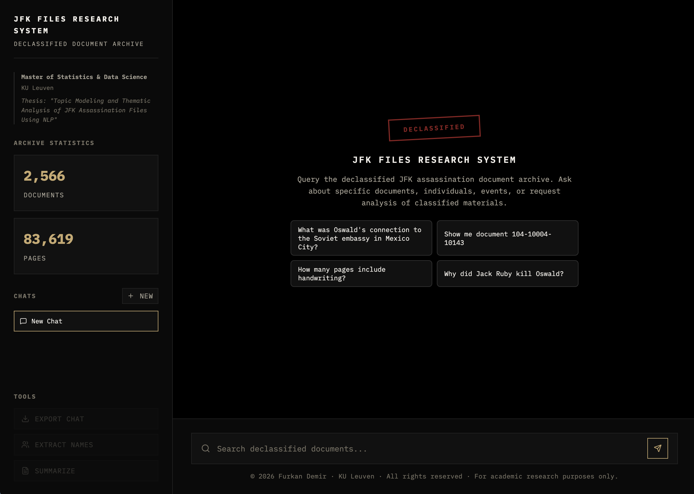

# JFK Files Research System

A Retrieval-Augmented Generation (RAG) system for querying the 2025 declassified JFK assassination record release, built for the Master of Statistics & Data Science thesis at KU Leuven.

> *"Topic Modeling and Thematic Analysis of JFK Assassination Files Using NLP"*

Live demo: https://jfk-files-rag-production.up.railway.app/
Thesis repo: https://github.com/furkan-sailpeak/jfk-thesis



## What it does

- **Grounded Q&A** over ~70,000 OCR-processed pages — every factual claim carries a `[N]` citation linked to the exact page on the National Archives PDF viewer.
- **Two answer modes** selected automatically by a router: *simple* (bold lead + bulleted facts) for single-fact queries, *research* (Executive Summary + Detailed Findings with `###` subsections) for analytical queries.
- **Conversational follow-ups** — pronouns and references ("what about his wife?", "tell me more") resolve against the last few turns before retrieval runs.
- **Archive-level queries** — ask about metadata properties (pages with redactions, handwriting, stamps, etc.) and get counts + sampled examples instead of a single-page answer.
- **Honest refusals** — questions unrelated to the archive short-circuit to a fixed refusal line; the system does not confabulate.

## Architecture

**Backend:** Python 3.11 · Flask · PostgreSQL 15 + pgvector 0.8 (Supabase) · Groq (LLaMA 3.3 70B) · OpenAI (`text-embedding-3-small`, judge `gpt-5.4-mini`).
**Frontend:** React + Vite · Framer Motion · Lucide Icons · Server-Sent Events for token streaming.
**Deployment:** Docker / Railway.

### Retrieval pipeline

The request flow is a multi-stage agent pipeline with validation gates at each step:

```
User query
   │
   ▼
┌──────────────────────────────┐
│ Document-ID shortcut         │ regex: 104-10433-10209 style
│ (bypasses retrieval)         │──► fetch all pages, generate
└──────────────┬───────────────┘
               │ no ID match
               ▼
┌──────────────────────────────┐
│ Router agent (JSON-mode)     │ type ∈ {simple, research, metadata,
│ - classify query type        │        conversational, out_of_scope}
│ - rewrite pronouns           │ extracts 1–3 high-signal keywords,
│ - extract keywords           │ drops stopwords / generic verbs
└──────┬─────────────┬─────────┘
       │             │
       │             ├── out_of_scope ──► fixed refusal, stream, return
       │             └── conversational ─► free-chat branch, return
       ▼
┌──────────────────────────────┐
│ Hybrid retrieval             │  FTS leg: tsvector + ts_rank_cd on
│   FTS  ∪  vector             │           proper-noun keywords
│                              │  Vector leg: OpenAI embeddings (512-dim
│                              │           Matryoshka, stored as
│                              │           halfvec(512)) · cosine
│                              │           distance · ivfflat index
│                              │  Union deduped on (filename, page) and
│                              │  content prefix.
└──────────────┬───────────────┘
               ▼
┌──────────────────────────────┐
│ Rerank (LLM judge)           │ drops admin/index/cover chunks that
│ top-K → 15–20 keep           │ share keywords but don't discuss
│                              │ the subject; prefers substantive text.
└──────────────┬───────────────┘
               ▼
┌──────────────────────────────┐
│ Streamed generation          │ simple vs. research system prompt
│ (Groq / LLaMA 3.3 70B)       │ + tail-of-prompt FORMAT REMINDER
│                              │ (small models weight the tail)
└──────────────┬───────────────┘
               ▼
┌──────────────────────────────┐
│ Grounding check              │ second LLM pass: is the answer
│ (subject + support)          │ on-topic and not fabricating?
│                              │ if FAIL → expand query → regenerate
└──────────────┬───────────────┘
               ▼
┌──────────────────────────────┐
│ Citation verifier            │ per-[N] check: does source N actually
│                              │ support the sentence citing it?
│                              │ unsupported [N] stripped in place,
│                              │ surviving citations renumbered 1..M.
└──────────────┬───────────────┘
               ▼
          SSE stream
      { token, stage, done }
```

### Why hybrid retrieval?

Early versions used FTS only. Semantic questions ("who killed Oswald?") kept missing the obvious answer because the Ruby-shoots-Oswald pages don't contain the literal word "killed" — they say *"fired … fatal shot"*. Adding a pgvector leg (via `halfvec(512)` — Matryoshka-truncated embeddings that fit the Supabase free-tier disk budget at ~6× lower storage than `vector(1536)`) recovers those pages. FTS still carries proper-noun precision; vector carries semantic/paraphrase recall.

### Prompt engineering notes

- **FORMAT REMINDER at the tail.** LLaMA-3.3 forgets long system-prompt formatting rules by the time it generates. Hoisting a minimal "your output must look exactly like this" block to the very end of the user prompt raised structure-compliance from ~60% to 100% on the eval set.
- **Router "PREFER / SKIP" rules.** Telling the router to prefer proper nouns and skip generic relational verbs ("role", "played", "involved") prevents FTS rankings from being dominated by administrative policy documents.
- **Lenient citation verifier.** Claim-matching is paraphrase-tolerant. False-unsupported flags are more harmful than false-supported ones — a real source stripped from a valid citation looks worse to a researcher than a slightly imprecise link.

## Evaluation

The system is evaluated against a **30-question, corpus-grounded ground-truth set** authored directly from the archive (`eval/questions.yaml`). Each reference answer traces back to specific (filename, page) tuples. The judge is `gpt-5.4-mini` — a different model family from the one under test, so there is no self-judging bias.

**Categories (6 questions each):** `factual`, `biographical`, `analytical`, `partial_evidence`, `out_of_scope`.

**Metrics:**

| Type | Metric |
|---|---|
| Deterministic | `evidence_recall@20`, `evidence_precision`, `structure_ok`, `has_citations`, `no_bulk_cite`, `correct_refusal` |
| LLM judge | `faithfulness`, `completeness`, `hallucination`, `over_commits`, `clarity` |

See `eval/README.md` for run instructions.

## Setup

### Prerequisites

- Python 3.11+
- Node.js 20+
- PostgreSQL 15+ with `pgvector ≥ 0.8` extension (Supabase Pro or self-hosted)
- API keys: [Groq](https://console.groq.com/) (primary LLM) and [OpenAI](https://platform.openai.com/) (embeddings + judge)

### Environment variables

```bash
cp .env.example .env
```

| Variable | Purpose |
|---|---|
| `DATABASE_URL` | PostgreSQL connection string |
| `GROQ_API_KEY` | Groq key (router, rerank, generation, grounding, citation verify) |
| `OPENAI_API_KEY` | OpenAI key (query embeddings; eval judge) |
| `JUDGE_MODEL` | *optional* — override Groq judge model (default `llama-3.3-70b-versatile`) |
| `JUDGE_MODEL_EVAL` | *optional* — override eval judge (default `gpt-5.4-mini`) |

### Local development

```bash
# Backend
cd rag
pip install -r requirements.txt
python app.py                 # serves on :5001

# Frontend (separate terminal)
cd rag/frontend
npm install
npm run dev                   # Vite proxies /api → :5001
```

### Embedding backfill (one-time)

After populating `jfk_pages` from OCR, embed every page so the vector leg has data to search:

```bash
cd rag
python backfill_embeddings.py  # idempotent; resumable
```

### Docker

```bash
cd rag
docker build -t jfk-rag .
docker run -p 5001:5001 \
  -e DATABASE_URL="..." \
  -e GROQ_API_KEY="..." \
  -e OPENAI_API_KEY="..." \
  jfk-rag
```

## API endpoints

| Endpoint | Method | Description |
|---|---|---|
| `/api/chat` | POST | Streamed RAG query (SSE); accepts `{query, history}` |
| `/api/stats` | GET | Archive statistics |
| `/api/analyze` | POST | Extract names or summarize text |
| `/api/pdf/<filename>` | GET | Redirect to NARA archive PDF |

## Project layout

```
.
├── rag/                       # Flask backend + React frontend
│   ├── app.py                 # Pipeline orchestration (router → retrieve → rerank → generate → verify)
│   ├── backfill_embeddings.py # One-shot OpenAI embedding backfill into pgvector
│   ├── frontend/              # React UI (SSE streaming, citation linking)
│   └── Dockerfile
├── prompts/                   # All system prompts in one place (router, rag-simple, rag-research, reranker, ...)
├── eval/                      # Evaluation framework
│   ├── questions.yaml         # 30 corpus-grounded questions
│   ├── run.py                 # Drive the RAG server over every question
│   ├── score.py               # Deterministic + LLM-judge metrics → scores.json + report.md
│   └── README.md              # Framework docs
├── database/                  # SQL schema + pgvector migration scripts
├── scripts/                   # OCR ingestion, misc utilities
├── ocr_output/                # Raw OCR JSON (not committed)
└── rag-architecture-diagram.html
```

## License

© 2026 Furkan Demir · KU Leuven · All rights reserved · For academic research purposes only.

Academic project, KU Leuven. The JFK records are public domain (NARA, 2025 release). See [LICENSE](LICENSE) for details.
